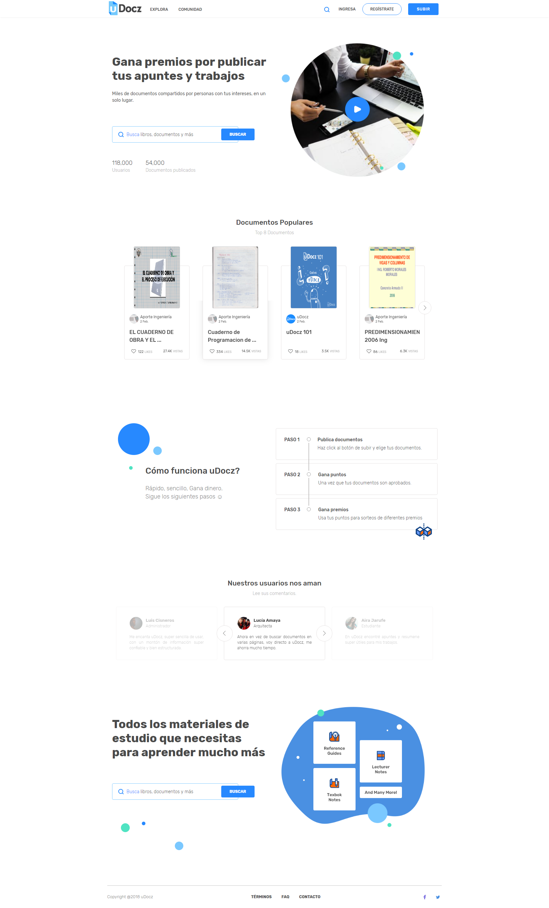

## Propuesta Diseño Landing Page uDocz

El rediseño del landing page de la plataforma uDocz se realizó con el fin de hacer la transición a un modelo pagado. 

__Elaborado por__ Shannon Rivera

### Página Actual

### Propuesta de Landing

[Ver prototipo en Marvel](https://marvelapp.com/6d65346/screen/42921087)

### Herramientas utilizadas

* InDesign
* Figma
* Marvel

### Referencias del cliente

* [Scribd](https://es.scribd.com/)
* [Safaribooks](https://www.safaribooksonline.com/)
